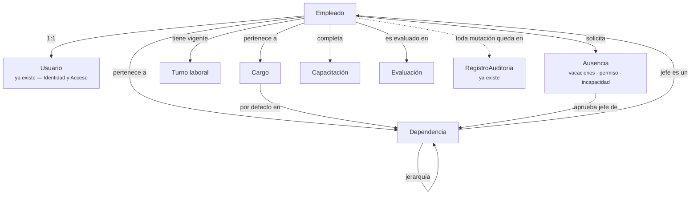

# 01 — Auditoría funcional: Talento Humano

> Área administrativa 1 de 4 (orden acordado: Talento Humano → Activos e
> inventario → Contratos y proveedores → PQRS y comunicaciones). Este
> documento se apoya en `00-diagnostico-arquitectura-actual.md` y no se debe
> leer aislado de él.

## 1. Alcance de este documento

Diseño conceptual del dominio Talento Humano: qué entidades, relaciones,
reglas y automatizaciones necesita el Terminal para administrar a su
personal interno, cómo se integra sin duplicar con lo que ya existe
(`Usuario`, RBAC, Auditoría), y qué cimientos transversales activa. **No
contiene diseño de base de datos ni de API** — eso es una fase posterior,
fuera del alcance de este rol de arquitecto/consultor funcional.

## 2. Auditoría funcional — estado actual

Qué existe hoy en Skynet que toca, aunque sea tangencialmente, este dominio:

| Elemento existente | Qué cubre | Qué NO cubre |
|---|---|---|
| `Usuario.dependencia` (string libre) | Un campo de texto donde alguien puede escribir a qué área pertenece | Jerarquía, validación, reportabilidad, historial de cambios |
| `Usuario.rol` / `Rol` / `Permiso` | Qué puede **hacer** una persona en el sistema | Quién **es** esa persona como empleado (cargo, fecha de ingreso, tipo de vinculación) |
| `Usuario.estado` (activo/inactivo) | Si la cuenta puede iniciar sesión | Si la persona sigue vinculada laboralmente (son preguntas relacionadas pero no idénticas) |
| `RegistroAuditoria` | Traza genérica de mutaciones (quién/qué/cuándo/antes-después) | Nada específico de RR. HH. — pero es 100 % reutilizable tal cual |
| Módulo `induccion` (frontend puro) | Curso institucional con acordeón, encuesta y certificado en PDF generado **en el navegador** con `jsPDF` | No persiste nada en el backend: no hay registro server-side de quién completó la inducción ni cuándo. El "certificado" es un PDF que el usuario genera localmente, no una constancia verificable por el sistema |
| Módulo `danos` | Patrón de "cualquier usuario autenticado reporta algo universal" + gestión posterior por rol | No es RR. HH., pero es el precedente de diseño más cercano a "una persona reporta/solicita algo que otro rol gestiona" |
| Nada | — | No existe ninguna entidad que represente a una **persona** independiente de su cuenta de acceso. No existe Cargo, Dependencia formal, Turno, Ausencia, Capacitación (con registro server-side) ni Evaluación |

**Hallazgo clave de reutilización:** el módulo de inducción ya resolvió, en
el frontend, la experiencia de "contenido de formación + certificación" que
SG-SST va a necesitar para capacitaciones. Lo que le falta es la mitad
server-side (registro persistente de finalización, trazabilidad, reporte
por dependencia). Esto se retoma en §6.4 — es una razón concreta para NO
diseñar Capacitaciones desde cero.

## 3. Comprensión del negocio

### 3.1 La cadena de valor (validada con el usuario)

```
Empleado → Cargo → Dependencia → Turno → Vacaciones/Permisos →
Equipos asignados → Reportes realizados → Solicitudes →
Capacitaciones → Evaluaciones → Historial → Auditoría
```

Esta cadena describe el **ciclo de vida administrativo de una persona**
dentro del Terminal, no su acceso al sistema (eso ya existe y funciona).

### 3.2 El driver normativo: SG-SST

El usuario confirmó que el Terminal debe soportar el Sistema de Gestión de
Seguridad y Salud en el Trabajo (Decreto 1072). Esto no es un módulo más:
es una **restricción de diseño** que atraviesa varias entidades de este
dominio:

- Las **capacitaciones** deben quedar con constancia verificable (fecha,
  contenido, resultado si aplica), no solo con un PDF generado en el
  cliente.
- Los **incidentes de seguridad y salud en el trabajo** son conceptualmente
  parecidos a `Novedad` (que hoy vive en `operacion`, para incidentes de
  flota) pero **no son el mismo hecho de negocio**: un accidente laboral de
  un empleado tiene obligaciones de reporte, plazos y confidencialidad
  distintas a una novedad de un vehículo. No se debe reutilizar `Novedad`
  para esto — ver §4, entidad candidata "Incidente SG-SST".
- Las **ausencias por incapacidad médica** son un tipo de ausencia con
  reglas propias (soporte documental, en algunos casos afectación de nómina
  — fuera de alcance de Skynet como master, pero si en el futuro hay
  integración de nómina, esta es la entidad que la alimentaría).

### 3.3 Quién usa esta área

Solo personal interno (confirmado por el usuario: no hay portal externo
para esta área). Los actores son:

- **Super Administrador / Administrador**: gestión completa.
- **Un rol nuevo o extendido** con función de RR. HH. — el catálogo actual
  de 8 roles (`super_admin`, `administrador`, `empresa_transportadora`,
  `despachador`, `seguridad`, `operador`, `mantenimiento`,
  `usuario_comun`) no tiene un rol orientado a personal. Esto es una
  decisión de RBAC (no de este documento) que se resuelve **sin tocar
  código**: se crea el rol desde la pantalla "Roles y permisos" ya
  existente, una vez existan los permisos del dominio.
- **Cada empleado sobre su propio expediente**: consulta de su historial,
  solicitud de vacaciones/permisos, ver sus capacitaciones asignadas.
  Mismo patrón ya usado en `danos` ("Mis reportes") y aplicable aquí ("Mi
  expediente", "Mis solicitudes").
- **Jefe de dependencia**: aprueba solicitudes de su equipo. Esto es un rol
  *funcional* (aprobador), no necesariamente un `Rol` de RBAC nuevo — se
  resuelve mejor como una relación (`Dependencia.jefe → Empleado`) que
  autoriza dinámicamente, igual que `cargarScopeEmpresa` ya autoriza por
  relación en vez de por rol fijo.

## 4. Oportunidades de mejora — las 10 preguntas aplicadas

Antes de proponer cada entidad candidata, se responde el checklist
obligatorio del proyecto:

### Candidata: **Empleado**

1. ¿Ya existe algo parecido? — `Usuario` existe pero es una credencial, no
   una persona con historia laboral.
2. ¿Puede reutilizar información existente? — Sí: nombre, email ya están en
   `Usuario`; no se duplican, se referencian.
3. ¿Qué entidades participan? — Usuario (1:1), Cargo, Dependencia.
4. ¿Qué reglas de negocio aparecen? — Todo Empleado tiene Usuario (decisión
   ya tomada por el usuario); un Usuario puede existir sin ser Empleado
   (p. ej. roles operativos temporales) — la relación es opcional desde
   Usuario, obligatoria desde Empleado.
5. ¿Qué permisos requiere? — `talento_humano:gestionar` (administración
   completa), acceso implícito de cada empleado a su propio registro (no
   requiere permiso RBAC, igual que "reportar daño").
6. ¿Qué eventos genera? — `EmpleadoCreado`, `EmpleadoDesvinculado`,
   `EmpleadoCambioDependencia`.
7. ¿Qué auditoría necesita? — Reutiliza `RegistroAuditoria` tal cual existe
   hoy, sin cambios.
8. ¿Qué módulos afecta? — Usuario (relación nueva), Dashboard (nuevas
   tarjetas), sidebar (módulo nuevo).
9. ¿Qué dependencias crea? — Ninguna hacia cimientos transversales por sí
   sola.
10. ¿Cómo evitar duplicación? — Nunca copiar nombre/email desde `Usuario`
    hacia `Empleado`; siempre leer por referencia.

### Candidata: **Cargo** y **Dependencia**

1. ¿Ya existe algo parecido? — `Dependencia` existe como string libre en
   `Usuario`; `Cargo` no existe en ninguna forma.
2. ¿Puede reutilizar información existente? — Los valores hoy escritos a
   mano en `Usuario.dependencia` son la fuente para poblar el catálogo
   inicial de Dependencias (no se descartan, se normalizan).
3. ¿Qué entidades participan? — Dependencia puede tener jerarquía
   (padre/hijo) y un `jefe` (referencia a Empleado); Cargo pertenece a una
   Dependencia por defecto.
4. ¿Qué reglas de negocio aparecen? — Una Dependencia no puede eliminarse
   con empleados activos asignados (mismo patrón ya usado en `Rol`: no se
   puede eliminar un rol con usuarios asignados — reutilizar la regla, no
   solo la idea).
5. ¿Qué permisos requiere? — Parte de `talento_humano:gestionar`; no
   necesitan permiso propio salvo que la organización quiera delegar la
   administración de la estructura organizacional por separado.
6. ¿Qué eventos genera? — `DependenciaReorganizada` (cambia jefe o padre).
7. ¿Qué auditoría necesita? — Reutiliza `RegistroAuditoria`.
8. ¿Qué módulos afecta? — `Usuario.dependencia` (string) queda deprecado en
   favor de la referencia formal — es una migración de datos, no una
   ruptura funcional.
9. ¿Qué dependencias crea? — Ninguna hacia cimientos transversales.
10. ¿Cómo evitar duplicación? — Un único catálogo de Dependencias; cualquier
    módulo futuro que necesite "área del Terminal" (Activos por ubicación,
    Contratos por dependencia solicitante) referencia esta misma entidad,
    no crea su propia lista.

**Alerta de nomenclatura:** no llamar "Área" a Dependencia si en el futuro
"Área" se necesita para otra cosa (p. ej. áreas físicas del Terminal en el
dominio de Activos/Infraestructura). Se recomienda fijar el nombre
`Dependencia` desde ya para evitar colisiones semánticas como la que ya
existe entre "Horario" (rutas) y el turno laboral (siguiente candidata).

### Candidata: **Turno laboral** (⚠️ no usar el nombre "Horario")

1. ¿Ya existe algo parecido? — Existe `Horario` en `operacion`, pero es la
   hora de salida programada de una **ruta de bus**, un concepto de
   negocio completamente distinto. Reutilizar el nombre (aunque sea una
   entidad nueva) confundiría a cualquiera que lea "Horario" en el código o
   en un reporte.
2. ¿Puede reutilizar información existente? — No hay dato previo.
3. ¿Qué entidades participan? — Empleado, Dependencia (algunos turnos son
   por dependencia, ej. "turno de vigilancia").
4. ¿Qué reglas de negocio aparecen? — Un empleado tiene un turno vigente en
   un momento dado; los cambios de turno quedan en su historial.
5. ¿Qué permisos requiere? — `talento_humano:gestionar_turnos` (permiso
   separado de la gestión general, porque en muchas organizaciones lo
   administra un rol distinto — p. ej. Seguridad para vigilantes).
6. ¿Qué eventos genera? — `TurnoAsignado`.
7. ¿Qué auditoría necesita? — Reutiliza `RegistroAuditoria`.
8. ¿Qué módulos afecta? — Ninguno existente.
9. ¿Qué dependencias crea? — Ninguna.
10. ¿Cómo evitar duplicación? — Nombre distinto de `Horario` por diseño,
    documentado aquí explícitamente.

### Candidata: **Ausencia** (unifica vacaciones, permisos, incapacidades)

1. ¿Ya existe algo parecido? — No. El módulo `danos` es el precedente de
   patrón (solicitud simple con estado), no de dominio.
2. ¿Puede reutilizar información existente? — No hay dato previo que
   reutilizar, pero sí el **patrón de flujo** de aprobación que se propone
   como cimiento transversal (§7).
3. ¿Qué entidades participan? — Empleado (solicitante), Empleado (aprobador
   — normalmente el jefe de su Dependencia), tipo de ausencia.
4. ¿Qué reglas de negocio aparecen? — No se solapan dos ausencias del mismo
   empleado; una incapacidad requiere soporte documental (dependencia hacia
   Gestión documental, §7); las vacaciones pueden requerir saldo disponible
   (regla a definir con RR. HH. real del Terminal, no se asume aquí).
5. ¿Qué permisos requiere? — Solicitar es universal para todo empleado (no
   es permiso RBAC, es "ser Empleado"); aprobar requiere ser el jefe de la
   Dependencia del solicitante (autorización por relación, no por permiso
   fijo) o tener `talento_humano:gestionar`.
6. ¿Qué eventos genera? — `AusenciaSolicitada`, `AusenciaAprobada`,
   `AusenciaRechazada`.
7. ¿Qué auditoría necesita? — Reutiliza `RegistroAuditoria`; además,
   `Ausencia` en sí misma **es** el historial (no se necesita una colección
   de historial aparte, ver §6.6).
8. ¿Qué módulos afecta? — Dashboard (tarjeta de "solicitudes pendientes de
   aprobar" para jefes de dependencia).
9. ¿Qué dependencias crea? — **Motor de solicitud → aprobación** (cimiento
   transversal, §7) y, para incapacidades, **Gestión documental** (§7).
10. ¿Cómo evitar duplicación? — Una sola entidad `Ausencia` con un campo de
    tipo (vacaciones/permiso/incapacidad), no tres colecciones paralelas
    que reimplementarían el mismo flujo de aprobación tres veces.

### Candidata: **Capacitación** (SG-SST)

1. ¿Ya existe algo parecido? — **Sí, fuerte**: el módulo `induccion`
   (frontend) ya resuelve contenido + progreso + certificado.
2. ¿Puede reutilizar información existente? — El *patrón de UX* sí (curso →
   acordeón → certificado); el dato NO, porque hoy no se persiste en
   backend.
3. ¿Qué entidades participan? — Empleado, Capacitación (definición del
   curso/tema), registro de finalización por empleado.
4. ¿Qué reglas de negocio aparecen? — Algunas capacitaciones SG-SST son
   obligatorias y recurrentes (vencen y deben repetirse) — igual que SOAT/
   tecnomecánica en `Vehiculo` ya modelan "vence y hay que renovar": es el
   mismo patrón conceptual de vencimiento que el sistema ya sabe expresar.
5. ¿Qué permisos requiere? — `talento_humano:gestionar_capacitaciones`
   para administrar el catálogo y asignar; completar es universal (ser
   Empleado).
6. ¿Qué eventos genera? — `CapacitacionAsignada`, `CapacitacionCompletada`,
   `CapacitacionPorVencer`.
7. ¿Qué auditoría necesita? — Reutiliza `RegistroAuditoria`.
8. ¿Qué módulos afecta? — Posiblemente el propio módulo `induccion` se
   convierte en el primer caso de uso de este dominio (la inducción **es**
   una capacitación obligatoria de ingreso) — a decidir con el usuario si
   se migra o se deja como está.
9. ¿Qué dependencias crea? — **Gestión documental** (certificados como PDF
   verificable, no generado solo en cliente) y, opcionalmente,
   **Notificaciones** (avisar vencimiento próximo).
10. ¿Cómo evitar duplicación? — No crear un segundo sistema de "curso con
    certificado" en paralelo al de inducción: o se generaliza el existente,
    o se documenta explícitamente por qué son cosas distintas.

### Candidata: **Evaluación** (desempeño)

1. ¿Ya existe algo parecido? — No.
2. ¿Puede reutilizar información existente? — Depende de Cargo (los
   criterios de evaluación normalmente son por cargo) y Dependencia.
3. ¿Qué entidades participan? — Empleado (evaluado), Empleado (evaluador),
   Cargo (define criterios).
4. ¿Qué reglas de negocio aparecen? — Periodicidad (anual/semestral),
   confidencialidad (el evaluado no necesariamente ve el detalle antes de
   una retroalimentación formal — regla a validar con el negocio real, no
   se asume aquí).
5. ¿Qué permisos requiere? — `talento_humano:evaluar` — deliberadamente
   distinto de `talento_humano:gestionar`, porque quién evalúa a menudo no
   es quien administra el expediente.
6. ¿Qué eventos genera? — `EvaluacionRegistrada`.
7. ¿Qué auditoría necesita? — Reutiliza `RegistroAuditoria`.
8. ¿Qué módulos afecta? — Ninguno existente.
9. ¿Qué dependencias crea? — Ninguna transversal nueva.
10. ¿Cómo evitar duplicación? — Ninguna colisión detectada.

### Candidata: **Equipos asignados** — NO se diseña en este documento

El usuario ya definió el orden: Activos e inventario es la **siguiente**
área, no esta. Aquí solo se deja constancia de la relación que Talento
Humano expondrá hacia ese dominio futuro: un Empleado tiene activos
asignados, pero la entidad Activo/Equipo, su ciclo de vida y sus
mantenimientos se auditan y proponen en `02-activos-inventario.md`
(pendiente). Modelarlo ahora sería anticipar un área que todavía no se ha
auditado — justo lo que la metodología del proyecto prohíbe.

### Candidata: **Historial** — no es una entidad nueva

Aplicando la pregunta 1 ("¿ya existe algo parecido?") con rigor: un
"historial" de Empleado no es una colección aparte. Es la **proyección** de
`RegistroAuditoria` + los propios registros de `Ausencia`, `Capacitación` y
`Evaluación` filtrados por ese Empleado. Crear una colección `Historial`
sería la duplicación exacta que los principios obligatorios prohíben.

## 5. Reorganización propuesta

Separar dos dominios relacionados, no fusionarlos:

- **Identidad y Acceso** (ya existe: `Usuario`, `Rol`, `Permiso`) — sigue
  respondiendo *"qué puede hacer esta persona en el sistema"*. No se toca
  su responsabilidad.
- **Talento Humano** (nuevo) — responde *"quién es esta persona para el
  Terminal"*: su cargo, su dependencia, su historia laboral. Se relaciona
  con Identidad y Acceso por una referencia 1:1 (`Empleado → Usuario`), tal
  como el usuario decidió ("todo empleado tendrá usuario").

**Por qué no fusionarlos en un solo documento/colección** aunque hoy la
relación sea 1:1 obligatoria: son responsabilidades que cambian por
razones distintas y en momentos distintos (un reseteo de contraseña no es
un evento laboral; un cambio de cargo no es un evento de seguridad de
sesión), y la separación es la que ya usa el propio sistema en el patrón
`Usuario` + `Rol` (credencial vs. autorización, dos colecciones
relacionadas). Se señala como **recomendación**, a validar contigo antes de
construirse — es una decisión de diseño, no un hecho consumado.

## 6. Dominio propuesto: Talento Humano

### 6.1 Submódulos

1. **Estructura organizacional** — Cargo, Dependencia (jerarquía, jefe).
2. **Expediente del empleado** — Empleado y su vínculo con Usuario, Cargo,
   Dependencia.
3. **Gestión del tiempo** — Turno laboral, Ausencias (vacaciones, permisos,
   incapacidades unificadas).
4. **Formación** — Capacitaciones (SG-SST y otras), reutilizando/
   generalizando el patrón ya construido en `induccion`.
5. **Desempeño** — Evaluaciones.

*(Un sexto submódulo, "Activos asignados", queda como relación saliente
hacia el área siguiente, no como parte de este dominio.)*

### 6.2 Mapa conceptual de relaciones



### 6.3 Reglas de negocio identificadas

- Todo Empleado tiene exactamente un Usuario; no todo Usuario es un
  Empleado (decisión ya tomada por el usuario, con la recomendación de
  mantenerlas como entidades separadas — §5).
- Una Dependencia no se elimina con empleados o cargos activos asignados
  (mismo patrón que ya protege a `Rol`).
- El jefe de una Dependencia es, él mismo, un Empleado — no un campo de
  texto ni un `Usuario` suelto.
- Las Ausencias no se solapan para un mismo Empleado.
- Las Capacitaciones obligatorias (SG-SST) pueden vencer y requieren
  renovación — mismo concepto que SOAT/tecnomecánica en `Vehiculo`.
- Desvincular a un Empleado es un hecho de negocio con efectos en cascada
  (ver §6.5) — nunca un `delete` directo, igual que hoy `Rol`/`Empresa` usan
  `estado` en vez de borrado físico.

### 6.4 Automatizaciones

- Alertar (Dashboard + notificación) cuando una capacitación obligatoria
  está por vencer — mismo patrón conceptual que ya existiría para
  documentos de vehículos si se generalizara.
- Al aprobar una Ausencia tipo vacaciones/incapacidad, notificar
  automáticamente al Empleado solicitante.
- Al crear un Empleado, sugerir (no forzar) el Turno por defecto de su
  Dependencia.

### 6.5 Eventos de dominio que este área genera

Estos eventos son el caso de uso concreto que justifica el bus de eventos
señalado como cimiento en el diagnóstico (`00-diagnostico`, §5). Se listan
como contrato conceptual, no como implementación:

| Evento | Quién reacciona (hoy, sin bus, sería acoplamiento directo) |
|---|---|
| `EmpleadoDesvinculado` | Identidad y Acceso (desactivar Usuario), futura área Activos (liberar equipos asignados), Formación (cerrar capacitaciones pendientes) |
| `EmpleadoCambioDependencia` | Gestión del tiempo (revisar Turno vigente) |
| `AusenciaAprobada` | Notificaciones (avisar al empleado) |
| `CapacitacionPorVencer` | Notificaciones, Dashboard |

Este es precisamente el ejemplo que motiva el bus de eventos: sin él, el
`service` de Empleado tendría que importar y llamar directamente al
`service` de Usuario, al futuro `service` de Activos y al de Capacitaciones
— tres módulos acoplados a uno solo, que es exactamente lo que "bajo
acoplamiento" prohíbe.

### 6.6 Indicadores y dashboard

Tarjetas candidatas para el Dashboard existente (`resumenDashboard`, ya
construido con el patrón "cada rol ve solo lo suyo"):

- Empleados activos por Dependencia.
- Solicitudes de ausencia pendientes de aprobar (para jefes de Dependencia).
- Capacitaciones SG-SST vencidas o por vencer (para RR. HH. y Seguridad).
- Evaluaciones pendientes del periodo.

## 7. Cimientos transversales que este área activa

Confirmando lo señalado en el diagnóstico (`00-diagnostico`, §5), Talento
Humano es la primera área que **necesita de verdad**, no especulativamente:

- **Motor de solicitud → aprobación** — lo requiere `Ausencia` (§4). Debe
  diseñarse genérico desde el inicio (solicitante, aprobador resuelto por
  relación organizacional, estados, trazabilidad) porque Contratos
  (aprobación de un contrato) y PQRS (flujo de atención) previsiblemente lo
  reutilizarán.
- **Gestión documental transversal** — la requieren las incapacidades
  (soporte médico) y las Capacitaciones (constancia verificable, no solo un
  PDF generado en cliente). Debe generalizar el cableado a Cloudinary que
  hoy vive solo en `danos`.
- **Notificaciones como servicio transversal** — deseable, no bloqueante:
  Ausencias y Capacitaciones mejoran con ella, pero pueden lanzarse sin
  notificación automática si se prioriza.

No se diseñan en detalle en este documento (son transversales a varias
áreas, no propiedad de Talento Humano); se documentan aquí como el
requisito concreto que dispara su construcción.

## 8. Impacto sobre el sistema existente

| Módulo existente | Impacto |
|---|---|
| `Usuario` | Gana una relación opcional hacia `Empleado`. `Usuario.dependencia` (string) se deprecia en favor de la referencia formal — es una migración de datos, no rompe nada mientras conviva un periodo de transición. |
| RBAC (`Rol`/`Permiso`) | Se agregan permisos nuevos al catálogo (`talento_humano:*`); se recomienda un rol nuevo "Recursos Humanos", creable desde la UI existente sin tocar código. |
| `RegistroAuditoria` | Se reutiliza sin cambios. |
| Dashboard | Se agregan tarjetas nuevas, mismo patrón por permiso ya existente. |
| Sidebar (`modulosRegistry.js`) | Se agrega la entrada `talento_humano`, mismo patrón que cualquier módulo actual — y queda cubierta automáticamente por el gobierno de activación de módulos (`ModuloSistema`) recién construido: el Super Admin podrá apagar toda el área si algún día no se requiere. |
| Módulo `induccion` | Candidato a integrarse como el primer caso de uso de Capacitaciones — decisión pendiente de validar contigo, no asumida aquí. |

## 9. Cómo se evita duplicación — checklist de cierre

- ✅ No se crea una segunda tabla de "personas": se referencia `Usuario`.
- ✅ No se reutiliza `Empresa` para modelar la organización interna.
- ✅ No se reutiliza el nombre `Horario` para el turno laboral.
- ✅ No se reutiliza `Novedad` (flota) para incidentes SG-SST.
- ✅ No se crea una colección `Historial`: se deriva de `RegistroAuditoria` +
  las propias entidades del dominio.
- ✅ Vacaciones/permisos/incapacidades son una sola entidad (`Ausencia`) con
  tipo, no tres flujos paralelos.
- ✅ El patrón de aprobación se diseña una vez, como cimiento, no una vez
  por cada tipo de solicitud futura.

## 10. Resumen arquitectónico de cierre del área

- **Nuevas entidades conceptuales:** Empleado, Cargo, Dependencia, Turno
  laboral, Ausencia, Capacitación, Evaluación.
- **Relaciones clave:** Empleado 1:1 Usuario; Empleado N:1 Cargo y
  Dependencia; Dependencia jerárquica con jefe = Empleado; Ausencia
  aprobada por el jefe de la Dependencia del solicitante.
- **Reglas de negocio:** no-eliminación con dependientes activos (ya usada
  en `Rol`), no-solape de ausencias, vencimiento/renovación de
  capacitaciones obligatorias (ya usado en `Vehiculo`).
- **Automatizaciones/eventos:** desvinculación en cascada, alertas de
  vencimiento, notificación de aprobación — todos candidatos concretos para
  el bus de eventos señalado como cimiento.
- **Dependencias creadas:** motor de solicitud→aprobación (nuevo, activado
  por Ausencias), gestión documental transversal (nuevo, activado por
  incapacidades y certificados de capacitación).
- **Reutilización lograda:** Usuario, RBAC, Auditoría, patrón de
  vencimiento de `Vehiculo`, patrón de "solicitud universal + gestión por
  rol" de `danos`, y — pendiente de tu validación — el propio módulo
  `induccion` como primer caso de uso de Capacitaciones.
- **Impacto sobre el sistema existente:** aditivo en todos los casos;
  ningún módulo actual pierde funcionalidad; `Usuario.dependencia` (string)
  queda en transición hacia la referencia formal.

## 11. Preguntas abiertas antes de construir

Estas son decisiones de negocio o de alcance que este documento
deliberadamente no asume, porque le corresponden al usuario, no al equipo
de arquitectura:

1. ¿`Empleado` y `Usuario` se mantienen como dos entidades relacionadas
   (recomendado, §5) o se prefiere fusionarlas en un solo documento pese al
   acoplamiento que eso crea entre acceso y expediente laboral?
2. ¿El módulo `induccion` se migra para apoyarse en la futura entidad
   Capacitación, o se mantiene independiente y Capacitaciones nace aparte?
3. ¿Quién aprueba una Ausencia cuando el solicitante **es** el jefe de su
   propia Dependencia (jefe de un área sin superior directo en el
   organigrama)? Necesita una regla explícita antes de construirse.
4. ¿Las Evaluaciones de desempeño ya tienen un formato/periodicidad
   definida por el Terminal, o se diseña un esquema flexible desde cero?
5. ¿Se confirma el rol nuevo "Recursos Humanos" en el catálogo RBAC, o la
   gestión de este dominio queda dentro de `administrador`?

Con tus respuestas a estas cinco preguntas, este documento queda cerrado y
se procede a `02-activos-inventario.md`.
